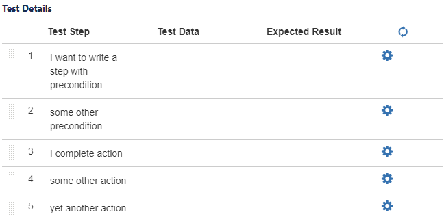

# zephyer

This Framework will help you to update the Test Cycle Status and Steps of the Test Case which is executed in the Test Cycle.

With the help of cucumber json report it will update the status.

Usage:

	1. Each Test Case should be added as one scenario in the feature file.
	2. Our feature file Steps and Zephyr test case steps should be same.
	3. update the application.properties file with your jira and zephyr credentials.
	4. Then just call "updateTestCaseAndStepStatus" method as specified in the Test.java class in your AfterSuite.
	5. Then this framework will take care of updating the all the test case which is executed in the current run to the jira.
	
Example:
	
  

Reference:

	Jwt token Generation - https://github.com/zephyrdeveloper/zapi-cloud
	Zephyr cloud api doc - https://zfjcloud.docs.apiary.io/#
	Jira clud api doc - https://developer.atlassian.com/cloud/jira/platform/rest/
